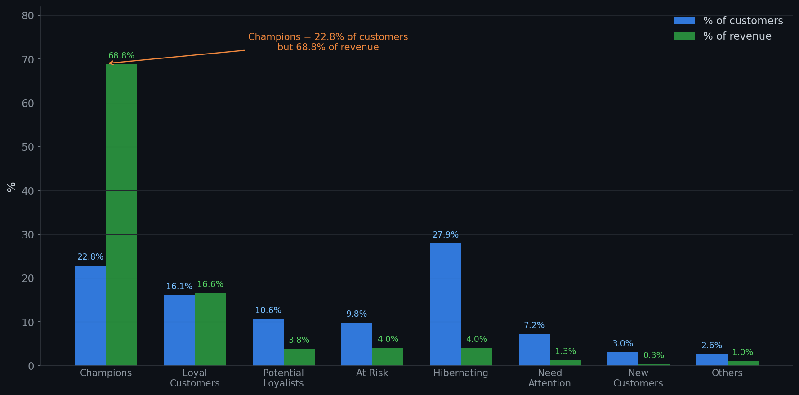

# Customer Segmentation ด้วย RFM Analysis

วิเคราะห์พฤติกรรมลูกค้าจากข้อมูลการซื้อขายจริงของร้านค้าออนไลน์ในอังกฤษ แล้วจัดกลุ่มลูกค้าเพื่อเสนอแนะกลยุทธ์การตลาดที่เหมาะกับแต่ละกลุ่ม

# Dataset

- ที่มา: [UCI Online Retail II](https://www.kaggle.com/datasets/mashlyn/online-retail-ii-uci?resource)
- ขนาด: 1,067,371 transactions 
- ช่วงเวลา: ธ.ค. 2009 – ธ.ค. 2011

# เครื่องมือที่ใช้

- MySQL (Workbench) — cleaning, RFM calculation, segmentation

# สิ่งที่ทำ

# 1. Data Cleaning

ข้อมูลดิบมีปัญหาหลายจุดที่ต้องจัดการก่อนวิเคราะห์

| ปัญหา | จำนวน | วิธีจัดการ |
|--------|---------|-----------|
| Customer ID หายไป | 243,007 rows (22.8%) | ลบออก เพราะไม่รู้ว่าใครซื้อ ทำ RFM ไม่ได้ |
| Cancelled orders | 19,494 rows | ลบออก ไม่ใช่การซื้อจริง |
| Quantity ติดลบ | 22,950 rows | ลบออก เป็นการคืนสินค้า |
| Price เป็น 0 หรือติดลบ | 6,207 rows | ลบออก คำนวณยอดเงินไม่ได้ |
| StockCode ไม่ใช่สินค้า | ~5,800 rows | ลบออก เป็นค่าส่ง/ค่าธรรมเนียม |

หลัง cleaning เหลือ **802,644 rows** (ลบไปประมาณ 25%)

# 2. RFM Analysis

คำนวณค่า 3 ตัวของลูกค้าแต่ละคน:

- **Recency** — ซื้อครั้งล่าสุดเมื่อกี่วันที่แล้ว (ยิ่งน้อยยิ่งดี)
- **Frequency** — ซื้อทั้งหมดกี่ครั้ง (ยิ่งมากยิ่งดี)
- **Monetary** — ใช้จ่ายรวมเท่าไหร่ (ยิ่งมากยิ่งดี)

แล้วให้คะแนน 1-5 ด้วย NTILE จากนั้นจัดกลุ่มลูกค้าเป็น 8 segments

# 3. ผลลัพธ์

# Business Insights

1. Champions มีแค่ 22.8% ของลูกค้า แต่สร้างรายได้ 68.8%

ลูกค้ากลุ่มนี้ซื้อบ่อย (avg 16.5 ครั้ง) และเพิ่งซื้อไม่นาน (avg 20 วัน) ถ้าสูญเสียลูกค้ากลุ่มนี้ไป รายได้จะหายไปเกือบ 70% ควรมีสิทธิพิเศษเฉพาะกลุ่มนี้เพื่อรักษาไว้

2. At Risk มี 571 คน ที่เคยซื้อบ่อยแต่เริ่มหายไป

ลูกค้ากลุ่มนี้เคยสั่งเฉลี่ย 3.5 ครั้ง แต่ตอนนี้ห่างหายไปแล้ว 209 วัน ยังมีโอกาสดึงกลับมาได้

3. New Customers ต้องดูแลก่อนจะหายไป

มีลูกค้าใหม่ 173 คน เพิ่งซื้อแค่ 1 ครั้ง ถ้าไม่มี follow-up ลูกค้ากลุ่มนี้จะกลายเป็น Hibernating ภายในไม่กี่เดือน 

4. Hibernating เยอะที่สุด (27.9%) แต่ไม่ควรทุ่มงบมาก

ลูกค้า 1,631 คนหายไปเฉลี่ย 454 วัน สั่งแค่ 1.3 ครั้ง โอกาสกลับมาต่ำ 
